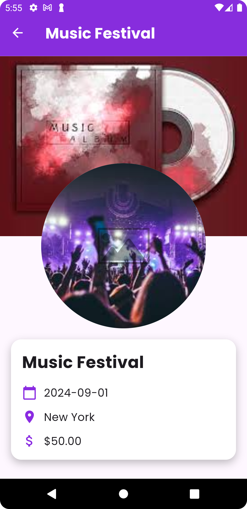
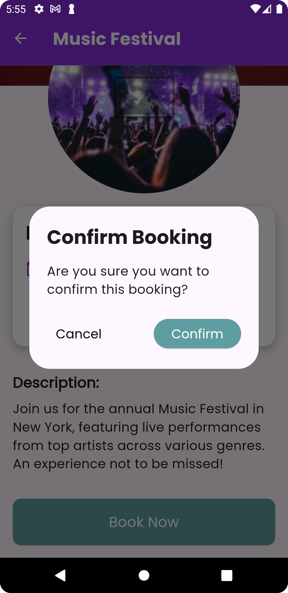
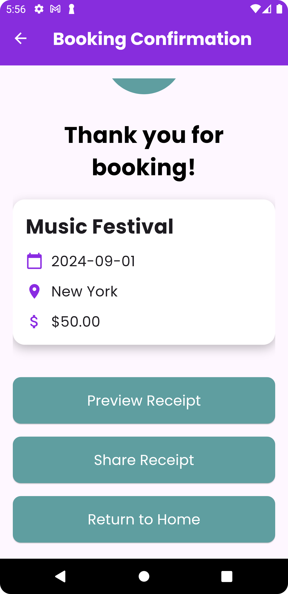
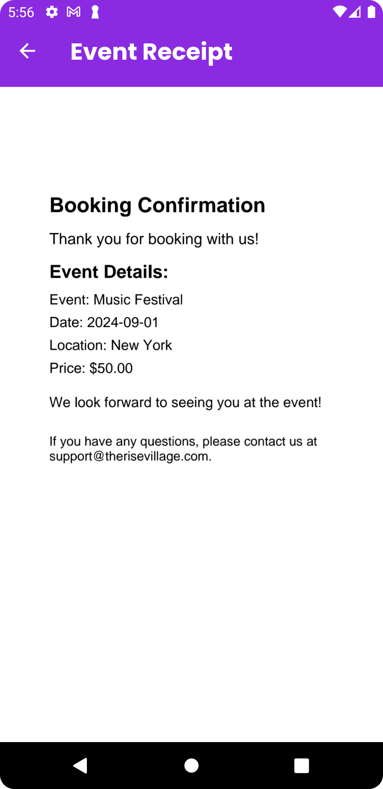
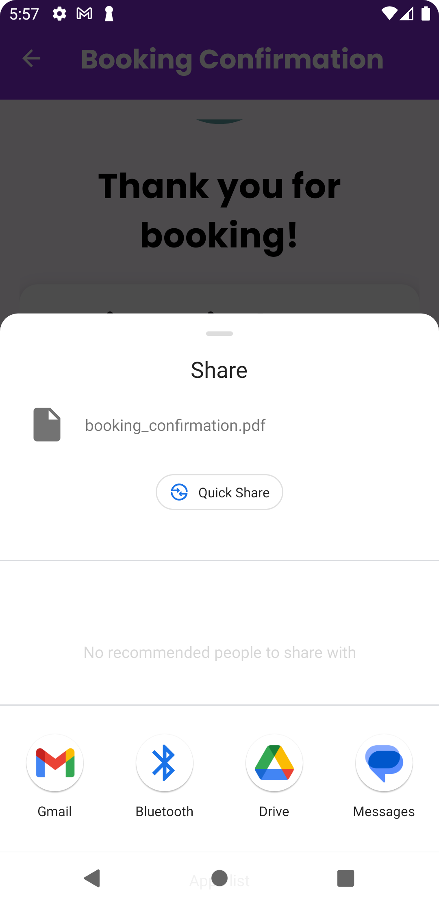

# Rise Tech Event Booking App

## Overview

Rise Tech Event Booking is a mobile application that allows users to browse, book, and manage event bookings. The app features a clean, user-friendly interface with rich animations and seamless navigation between screens.

## Features

- Browse a variety of events categorized by type (Music, Tech, Sports, Art, etc.).
- Filter events by date, location, and category.
- View detailed event information, including date, location, price, and description.
- Book events directly from the app and receive a confirmation receipt.
- Share event booking receipts via PDF.
- Return to the home screen after booking to explore more events.

## Download APK

You can download the latest version of the APK [here](https://drive.google.com/file/d/1YgCUrDAP6Adfm9oc4ZCuMJst0JL28cfN/view?usp=sharing).

## Screenshots

### Home Screen


### Home Screen Filter


### Event Details Screen

<p align="center">
  
  
  
</p>

### Booking Confirmation Screen
<p align="center">
  
  
  
  
 
</p>


## Getting Started

To get a local copy of the project up and running, follow these simple steps.

### Prerequisites

- Flutter SDK: [Flutter Installation Guide](https://flutter.dev/docs/get-started/install)
- Android Studio or Visual Studio Code

### Installation

1. **Clone the repository:**

   ```bash
   git clone https://github.com/your_username/rise_tech_event_booking.git
